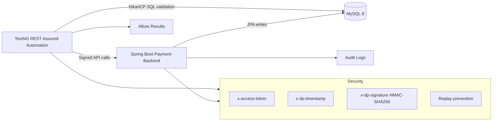

# PayFlowX

PayFlowX is an enterprise-grade API automation and fake payment transaction platform for secure payment orchestration testing. It combines a Spring Boot 3 backend, MySQL 8 persistence, and a REST Assured/TestNG automation framework that validates realistic payment workflows, security controls, database state, audit trails, and reporting artifacts.

This is not a CRUD sample. The system models distributed fintech transaction behavior: provider discovery, transaction creation, redirect authorization, receipt validation, finalization, charging, subscription renewal, cancellation, status tracking, and database reconciliation.

## Architecture



## Modules

- `backend`: fake payment backend APIs implemented with Java 21, Spring Boot 3, JPA, validation, HMAC security, replay prevention, and audit logging.
- `automation`: enterprise REST Assured framework with reusable clients, filters, dynamic signing, workflow orchestration, DB validation, schema validation, Allure reporting, and TestNG parallel execution.
- `docker/mysql`: production-like MySQL schema, seed data, and cleanup scripts.
- `.github/workflows`: CI pipeline that builds, starts services, runs automation, and archives Allure results.

## Payment APIs

All APIs require:

- `x-access-token`
- `x-dp-signature`
- `x-dp-timestamp`

Implemented endpoints:

- `GET /providers?merchantId=...`
- `POST /transactions`
- `GET /transactions/{transactionId}`
- `POST /transactions/{transactionId}/finalise`
- `POST /transactions/{transactionId}/charge`
- `POST /transactions/{transactionId}/renew`
- `DELETE /transactions/{transactionId}/cancel`
- `POST /validateTransactionData`

Transaction statuses:

`CREATED`, `PENDING`, `PROCESSING`, `SUCCESS`, `FAILED`, `CANCELLED`, `CHARGED`, `RENEWED`

## Security Model

Requests are signed using:

```text
METHOD + "\n" + PATH + "\n" + QUERY_STRING + "\n" + EPOCH_MILLISECONDS
```

The backend validates token, HMAC-SHA256 signature, timestamp skew, and replayed signatures. The automation framework injects these headers dynamically through `SecurityHeaderFilter`.

## Mandatory Workflow Coverage

The primary workflow test executes:

1. Get providers
2. Create transaction
3. Extract `transactionId`
4. Extract `redirectURL`
5. Extract encoded `providerHash`
6. Validate provider data
7. Get receipt
8. Finalise transaction
9. Verify `SUCCESS`
10. Charge transaction
11. Renew subscription
12. Cancel transaction
13. Verify final DB state, subscription state, audit logs, and timestamps

Main workflow test:

`automation/src/test/java/com/payflowx/automation/workflows/PaymentLifecycleWorkflowTest.java`

## Database

Tables:

- `merchants`
- `providers`
- `transactions`
- `subscriptions`
- `audit_logs`

SQL scripts:

- `docker/mysql/schema.sql`
- `docker/mysql/seed-data.sql`
- `docker/mysql/cleanup.sql`
- `backend/src/main/resources/db/schema.sql`
- `backend/src/main/resources/db/seed-data.sql`

## Run Locally With Docker

Start MySQL and backend:

```bash
docker compose up --build mysql backend
```

Run the automation service:

```bash
docker compose --profile test up --build --abort-on-container-exit tests
```

## Run Locally Without Docker

Start MySQL 8 and initialize:

```bash
mysql -uroot -proot -e "CREATE DATABASE IF NOT EXISTS payflowx;"
mysql -uroot -proot payflowx < docker/mysql/schema.sql
mysql -uroot -proot payflowx < docker/mysql/seed-data.sql
```

Build and run the backend:

```bash
DB_URL='jdbc:mysql://localhost:3306/payflowx?useSSL=false&allowPublicKeyRetrieval=true&serverTimezone=UTC' \
DB_USERNAME=payflowx \
DB_PASSWORD=payflowx \
DB_DRIVER=com.mysql.cj.jdbc.Driver \
mvn -pl backend -am spring-boot:run
```

Run tests:

```bash
mvn -pl automation test
```

## Allure Reporting

Generate and open the report after tests:

```bash
mvn -pl automation allure:report
mvn -pl automation allure:serve
```

Allure includes API request/response payloads, headers, SQL validation details, timings, suite metadata, owners, epics, features, and severity.

## Framework Design

Key framework packages:

- `clients`: REST Assured API clients and reusable specifications
- `filters`: security header injection, logging, Allure attachments
- `auth`: HMAC signing
- `builders`: dynamic payment test data
- `db`: HikariCP connection management
- `validators`: response, schema, state transition, and DB validators
- `workflows`: business process orchestration
- `tests`, `smoke`, `regression`, `workflows`: categorized TestNG coverage

## Negative Coverage

Implemented negative scenarios include:

- invalid merchant
- invalid provider
- invalid amount
- invalid currency
- invalid token
- invalid signature
- expired timestamp
- duplicate finalization support in backend behavior
- invalid receipt support in backend behavior

## CI/CD

GitHub Actions workflow:

`.github/workflows/payflowx-ci.yml`

The pipeline provisions MySQL, loads schema and seed data, builds the backend, starts it, runs REST Assured automation, and archives Allure results and logs.

## Default Test Credentials

```text
PAYFLOWX_ACCESS_TOKEN=payflowx-enterprise-token
PAYFLOWX_SIGNING_SECRET=payflowx-super-secret-signing-key
PAYFLOWX_PROVIDER_PIN=4321
```

These are intentionally local defaults. Override them through environment variables in CI or secure runtime environments.
