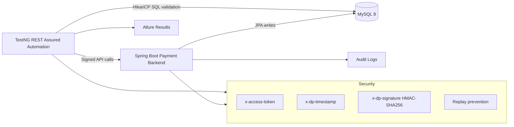

# qa-java-restassured-payments

PayFlowX: a REST Assured and TestNG suite that tests a signed, stateful payment API end to end, from provider discovery through charge, renewal and cancellation, and checks the database after every step.

[](https://github.com/yashwant-das/qa-java-restassured-payments/actions/workflows/payflowx-ci.yml)
[](https://github.com/yashwant-das/qa-java-restassured-payments/actions/workflows/codeql.yml)
[](https://yashwant-das.github.io/qa-java-restassured-payments/)
[](LICENSE)
[](pom.xml)
[](https://spring.io/projects/spring-boot)
[](https://rest-assured.io)
[](https://testng.org)

## Why it exists

Payment APIs fail in ways a CRUD test suite never sees: bad signatures, replayed requests, illegal state transitions and rows that disagree with the API response. PayFlowX pairs a fake Spring Boot payment backend with an automation framework that signs every request with HMAC-SHA256, walks the full transaction lifecycle, and validates the MySQL state and audit trail alongside each response.

## Architecture


```mermaid
flowchart LR
    T[TestNG REST Assured Automation] -->|Signed API calls| B[Spring Boot Payment Backend]
    T -->|HikariCP SQL validation| D[(MySQL 8)]
    B -->|JPA writes| D
    B --> A[Audit Logs]
    T --> R[Allure Results]
    subgraph Security
      S1[x-access-token]
      S2[x-dp-timestamp]
      S3[x-dp-signature HMAC-SHA256]
      S4[Replay prevention]
    end
    T --> Security
    B --> Security
```

The TestNG suite calls the backend through signed REST Assured clients and reads MySQL directly through HikariCP to confirm what the backend wrote. Allure collects every request, response and SQL check.

## Quickstart

Prerequisites: Docker with Compose v2. To run without Docker (Java 21, Maven 3.9+ and MySQL 8), follow [docs/local-setup.md](docs/local-setup.md).

```bash
git clone https://github.com/yashwant-das/qa-java-restassured-payments.git && cd qa-java-restassured-payments
docker compose up --build -d mysql backend                                  # MySQL on 3306, backend on 8080
docker compose --profile test up --build --abort-on-container-exit tests   # runs the suite
```

The tests container exits 0 when the suite passes. It uses local-only test credentials (listed in [docs/api-and-test-coverage.md](docs/api-and-test-coverage.md#local-test-credentials)); never reuse them elsewhere.

## Test reports and results

Every push and pull request to `main` runs these checks:

| Workflow | What it gates |
| --- | --- |
| [`payflowx-ci.yml`](.github/workflows/payflowx-ci.yml) | Compiles both modules and runs SpotBugs, then provisions MySQL, starts the backend, and runs the REST Assured suite. Test results appear as a check on the PR, and the Allure HTML report is attached to every run. |
| [`codeql.yml`](.github/workflows/codeql.yml) | CodeQL security and quality analysis for Java, also run weekly. |
| [`dependency-review.yml`](.github/workflows/dependency-review.yml) | Blocks pull requests that add dependencies with known high or critical vulnerabilities. |

On `main`, the latest Allure report is published to [GitHub Pages](https://yashwant-das.github.io/qa-java-restassured-payments/). Dependabot opens update PRs for Maven dependencies, GitHub Actions, and Docker base images.

Allure reports include request and response payloads, headers, SQL validation details, timings, and suite metadata (owners, epics, features, severity). To build one locally, and to run SpotBugs without the tests, see [docs/local-setup.md](docs/local-setup.md).

### What the suite covers

- The full transaction lifecycle in one workflow test: providers, create, validate provider data, receipt, finalise, charge, renew and cancel, then the final DB, subscription and audit-log state ([`PaymentLifecycleWorkflowTest.java`](automation/src/test/java/com/payflowx/automation/workflows/PaymentLifecycleWorkflowTest.java)).
- Every call is signed (access token, HMAC-SHA256 signature, timestamp) by a REST Assured filter, as the backend requires on all eight endpoints.
- Negative cases: invalid merchant, provider, amount, currency, token and signature, and an expired timestamp.

Endpoints, statuses, the signing scheme, tables and the framework packages are listed in [docs/api-and-test-coverage.md](docs/api-and-test-coverage.md).

## Tech stack

| Layer | Tool | Version | Why |
| --- | --- | --- | --- |
| Backend | Java, Spring Boot, Spring Data JPA | 21, 3.3 | A realistic payment service to test against |
| Database | MySQL | 8.4 | State and audit trail the tests reconcile against |
| API tests | REST Assured, TestNG | 5.5, 7.10 | Fluent HTTP clients, filters and parallel suites |
| Assertions | AssertJ, JSON Schema Validator | 3.26, 5.5 | Readable assertions and response contracts |
| DB validation | HikariCP, MySQL Connector/J | 5.1, 8.4 | Direct SQL checks after each API call |
| Reporting | Allure | 2.29 | Request, response and SQL evidence per test |
| Static analysis | SpotBugs, CodeQL | 4.9, v4 | Build-time and security checks in CI |
| Runtime | Docker Compose, GitHub Actions | v2 | Same environment locally and in CI |

## Project structure

```text
├── backend/                 # Spring Boot payment API: auth, controllers, services, JPA entities
├── automation/              # REST Assured and TestNG framework
│   └── src/test/java/.../   # smoke, regression, integration, workflows, tests
├── docker/mysql/            # Schema, seed data and cleanup scripts
├── docs/                    # Architecture, API coverage and local setup
├── .github/workflows/       # CI, CodeQL and dependency review
├── docker-compose.yml
└── pom.xml                  # Parent build for both modules
```

## Documentation

- [docs/test-automation-framework-architecture.md](docs/test-automation-framework-architecture.md): framework architecture in depth
- [docs/api-and-test-coverage.md](docs/api-and-test-coverage.md): endpoints, signing scheme, coverage, database and local credentials
- [docs/local-setup.md](docs/local-setup.md): running without Docker, Allure and SpotBugs locally

## License

MIT. See [LICENSE](LICENSE).
