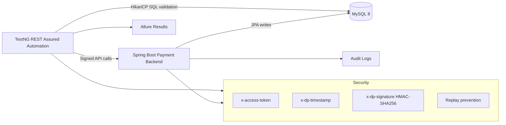

# qa-java-restassured-payments

PayFlowX: a REST Assured and TestNG suite that tests a signed, stateful payment API end to end, from provider discovery through charge, renewal and cancellation, and checks the database after every step.

[](https://github.com/yashwant-das/qa-java-restassured-payments/actions/workflows/payflowx-ci.yml)
[](https://github.com/yashwant-das/qa-java-restassured-payments/actions/workflows/codeql.yml)
[](https://yashwant-das.github.io/qa-java-restassured-payments/)
[](pom.xml)
[](LICENSE)

## Why it exists

Payment APIs fail in ways a CRUD test suite never sees: bad signatures, replayed requests, illegal state transitions and rows that disagree with the API response. PayFlowX pairs a fake Spring Boot payment backend with an automation framework that signs every request with HMAC-SHA256, walks the full transaction lifecycle, and validates the MySQL state and audit trail alongside each response.

## Architecture


```mermaid
flowchart LR
    T[TestNG REST Assured Automation] -->|Signed API calls| B[Spring Boot Payment Backend]
    T -->|HikariCP SQL validation| D[(MySQL 8)]
    B -->|JPA writes| D
    B --> A[Audit Logs]
    T --> R[Allure Results]
    subgraph Security
      S1[x-access-token]
      S2[x-dp-timestamp]
      S3[x-dp-signature HMAC-SHA256]
      S4[Replay prevention]
    end
    T --> Security
    B --> Security
```

The TestNG suite calls the backend through signed REST Assured clients and reads MySQL directly through HikariCP to confirm what the backend wrote. Allure collects every request, response and SQL check.

## Quickstart

Prerequisites: Docker with Compose v2. To run without Docker: Java 21, Maven 3.9+ and MySQL 8.

```bash
git clone https://github.com/yashwant-das/qa-java-restassured-payments.git && cd qa-java-restassured-payments
docker compose up --build -d mysql backend                                  # MySQL on 3306, backend on 8080
docker compose --profile test up --build --abort-on-container-exit tests   # runs the suite
```

The tests container exits 0 when the suite passes.

### Without Docker

Start MySQL 8 and initialize:

```bash
mysql -uroot -proot -e "CREATE DATABASE IF NOT EXISTS payflowx;"
mysql -uroot -proot payflowx < docker/mysql/schema.sql
mysql -uroot -proot payflowx < docker/mysql/seed-data.sql
```

Build and run the backend:

```bash
DB_URL='jdbc:mysql://localhost:3306/payflowx?useSSL=false&allowPublicKeyRetrieval=true&serverTimezone=UTC' \
DB_USERNAME=payflowx \
DB_PASSWORD=payflowx \
DB_DRIVER=com.mysql.cj.jdbc.Driver \
mvn -pl backend -am spring-boot:run
```

Run tests:

```bash
mvn -pl automation test
```

## Test reports and results

Every push and pull request to `main` runs these checks:

| Workflow | What it gates |
| --- | --- |
| [`payflowx-ci.yml`](.github/workflows/payflowx-ci.yml) | Compiles both modules and runs SpotBugs, then provisions MySQL, starts the backend, and runs the REST Assured suite. Test results appear as a check on the PR, and the Allure HTML report is attached to every run. |
| [`codeql.yml`](.github/workflows/codeql.yml) | CodeQL security and quality analysis for Java, also run weekly. |
| [`dependency-review.yml`](.github/workflows/dependency-review.yml) | Blocks pull requests that add dependencies with known high or critical vulnerabilities. |

On `main`, the latest Allure report is published to [GitHub Pages](https://yashwant-das.github.io/qa-java-restassured-payments/). Dependabot opens update PRs for Maven dependencies, GitHub Actions, and Docker base images.

Run the static analysis gate locally with:

```bash
mvn -DskipTests verify
```

SpotBugs suppressions live in [`spotbugs-exclude.xml`](spotbugs-exclude.xml).

Allure reports include API request and response payloads, headers, SQL validation details, timings, suite metadata, owners, epics, features and severity. To build and open one locally after a run:

```bash
mvn -pl automation allure:report
mvn -pl automation allure:serve
```

## What is tested

### Payment APIs

All APIs require:

- `x-access-token`
- `x-dp-signature`
- `x-dp-timestamp`

Implemented endpoints:

- `GET /providers?merchantId=...`
- `POST /transactions`
- `GET /transactions/{transactionId}`
- `POST /transactions/{transactionId}/finalise`
- `POST /transactions/{transactionId}/charge`
- `POST /transactions/{transactionId}/renew`
- `DELETE /transactions/{transactionId}/cancel`
- `POST /validateTransactionData`

Transaction statuses:

`CREATED`, `PENDING`, `PROCESSING`, `SUCCESS`, `FAILED`, `CANCELLED`, `CHARGED`, `RENEWED`

### Security model

Requests are signed using:

```text
METHOD + "\n" + PATH + "\n" + QUERY_STRING + "\n" + EPOCH_MILLISECONDS
```

The backend validates token, HMAC-SHA256 signature, timestamp skew, and replayed signatures. The automation framework injects these headers dynamically through `SecurityHeaderFilter`.

### End-to-end workflow coverage

The primary workflow test executes:

1. Get providers
2. Create transaction
3. Extract `transactionId`
4. Extract `redirectURL`
5. Extract encoded `providerHash`
6. Validate provider data
7. Get receipt
8. Finalise transaction
9. Verify `SUCCESS`
10. Charge transaction
11. Renew subscription
12. Cancel transaction
13. Verify final DB state, subscription state, audit logs, and timestamps

Main workflow test:

`automation/src/test/java/com/payflowx/automation/workflows/PaymentLifecycleWorkflowTest.java`

### Negative coverage

Implemented negative scenarios include:

- invalid merchant
- invalid provider
- invalid amount
- invalid currency
- invalid token
- invalid signature
- expired timestamp
- duplicate finalization support in backend behavior
- invalid receipt support in backend behavior

### Database

Tables:

- `merchants`
- `providers`
- `transactions`
- `subscriptions`
- `audit_logs`

SQL scripts:

- `docker/mysql/schema.sql`
- `docker/mysql/seed-data.sql`
- `docker/mysql/cleanup.sql`
- `backend/src/main/resources/db/schema.sql`
- `backend/src/main/resources/db/seed-data.sql`

### Local test credentials

Local-only defaults for the Docker and CI environments; never reuse them elsewhere.

```text
PAYFLOWX_ACCESS_TOKEN=payflowx-enterprise-token
PAYFLOWX_SIGNING_SECRET=payflowx-super-secret-signing-key
PAYFLOWX_PROVIDER_PIN=4321
```

These are intentionally local defaults. Override them through environment variables in CI or secure runtime environments.

## Tech stack

| Layer | Tool | Version | Why |
| --- | --- | --- | --- |
| Backend | Java, Spring Boot, Spring Data JPA | 21, 3.3 | A realistic payment service to test against |
| Database | MySQL | 8.4 | State and audit trail the tests reconcile against |
| API tests | REST Assured, TestNG | 5.5, 7.10 | Fluent HTTP clients, filters and parallel suites |
| Assertions | AssertJ, JSON Schema Validator | 3.26, 5.5 | Readable assertions and response contracts |
| DB validation | HikariCP, MySQL Connector/J | 5.1, 8.4 | Direct SQL checks after each API call |
| Reporting | Allure | 2.29 | Request, response and SQL evidence per test |
| Static analysis | SpotBugs, CodeQL | 4.9, v4 | Build-time and security checks in CI |
| Runtime | Docker Compose, GitHub Actions | v2 | Same environment locally and in CI |

## Project structure

```text
├── backend/                 # Spring Boot payment API: auth, controllers, services, JPA entities
├── automation/              # REST Assured and TestNG framework
│   └── src/test/java/.../   # smoke, regression, integration, workflows, tests
├── docker/mysql/            # Schema, seed data and cleanup scripts
├── docs/                    # Framework architecture
├── .github/workflows/       # CI, CodeQL and dependency review
├── docker-compose.yml
└── pom.xml                  # Parent build for both modules
```

### Framework packages (automation module)

Key framework packages:

- `clients`: REST Assured API clients and reusable specifications
- `filters`: security header injection, logging, Allure attachments
- `auth`: HMAC signing
- `builders`: dynamic payment test data
- `db`: HikariCP connection management
- `validators`: response, schema, state transition, and DB validators
- `workflows`: business process orchestration
- `tests`, `smoke`, `regression`, `workflows`: categorized TestNG coverage

## Documentation

- [docs/test-automation-framework-architecture.md](docs/test-automation-framework-architecture.md): framework architecture in depth

## License

MIT. See [LICENSE](LICENSE).
